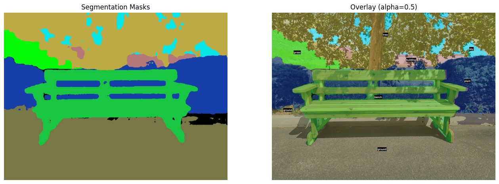
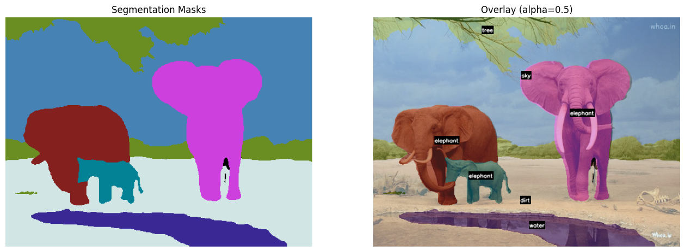

    <h1>Panoptic Segmentation using OneFormer   in Hugging Face </h1>

 

---

## 🏗️ Methodology

- 🎨🖌️ Panoptic Segmentation Model1: **shi-labs/oneformer_ade20k_swin_tiny**
- 🎨🖌️ Panoptic Segmentation Model2: **shi-labs/oneformer_ade20k_swin_large**
- 🎨🖌️ App: **ade20k**
- 🎨🖌️ Panoptic Segmentation Model3: **shi-labs/oneformer_coco_swin_large**
- 🎨🖌️ App: **COCO categories**
- 🎨🖌️ Framework: **PyTorch + Hugging Face**

---

## ⭐ Acknowledgements

- OneFormer powered by `Hugging Face`

---
